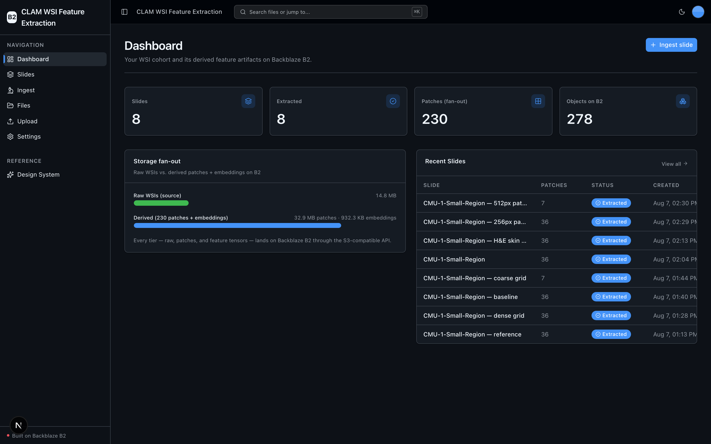
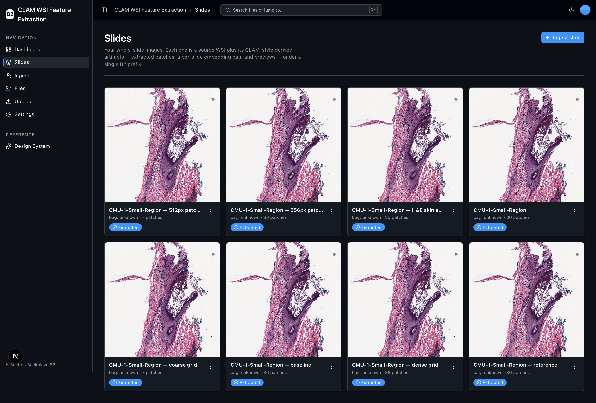
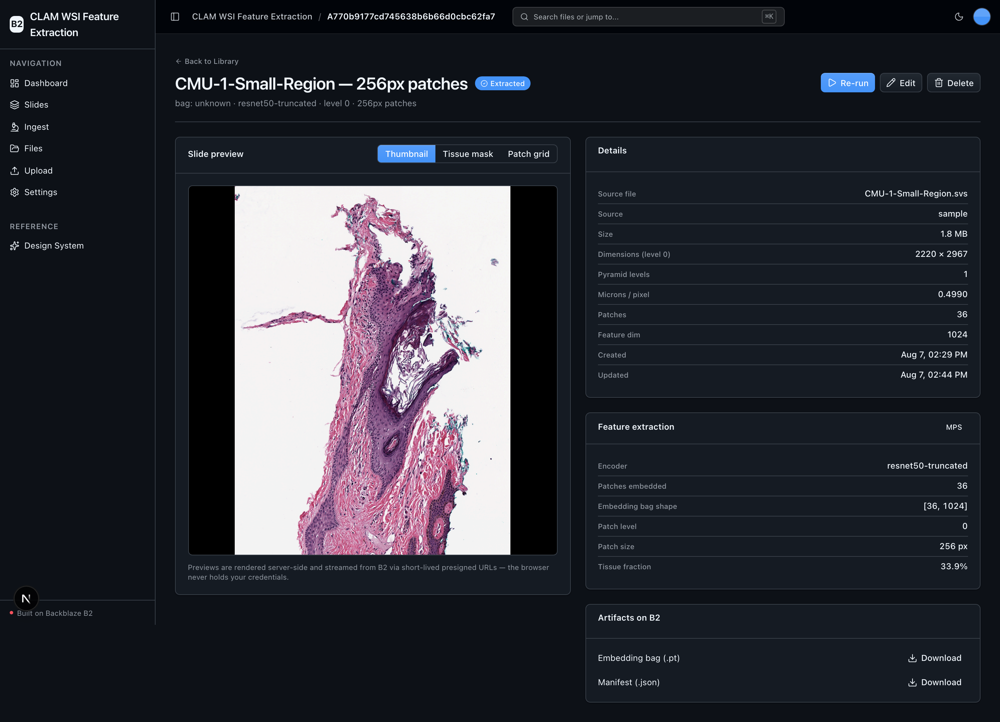
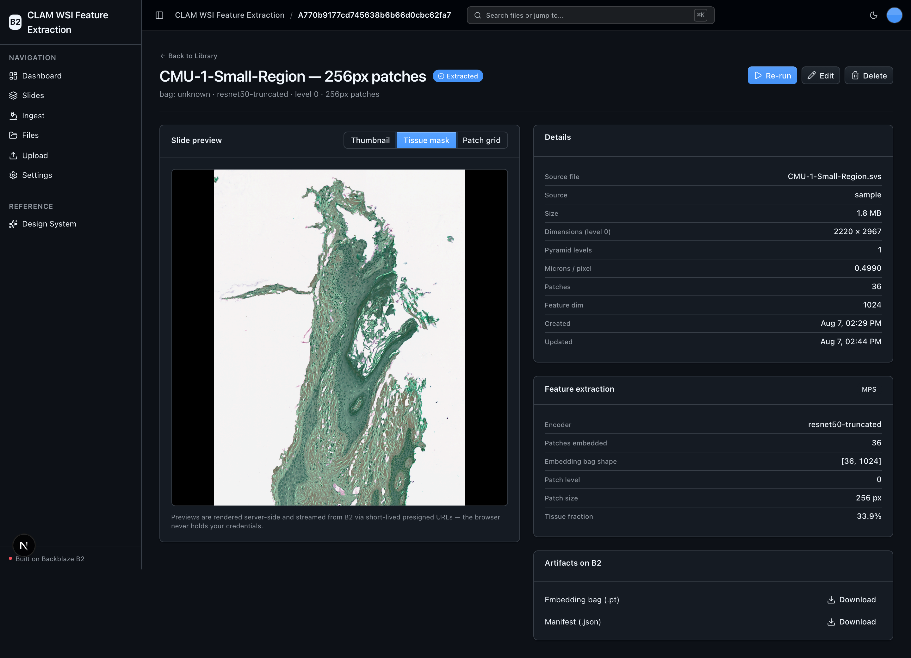
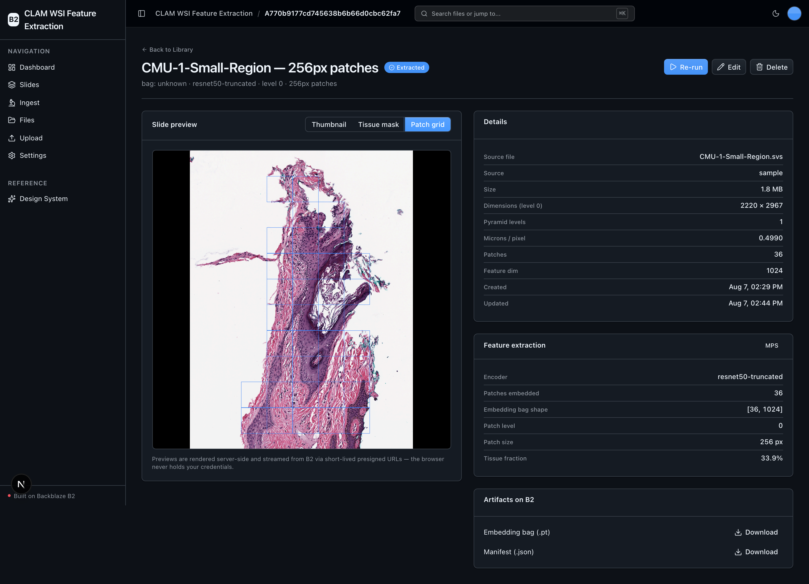

<!-- last_verified: 2026-08-07 -->
# CLAM WSI Feature Extraction

Turn **[Backblaze B2](https://www.backblaze.com/cloud-storage?utm_source=github&utm_medium=referral&utm_campaign=ai_artifacts&utm_content=b2ai-clam-wsi-feature-extraction)** into the storage layer for a whole-slide-image (WSI) feature-extraction pipeline. This sample tiles, tissue-segments, and CNN-embeds gigapixel pathology slides using a CLAM-style workflow (OpenSlide + a truncated ResNet50), and keeps every tier — **raw slides, extracted patches, and per-slide embedding tensors** — on B2 through the S3-compatible API. It is a runnable, cloud-native reference for **whole slide image storage on B2 (S3) for pathology**, **CLAM feature extraction to object storage**, and building an **OpenSlide WSI dataset pipeline on cloud storage**. Everything runs on local OSS — **no second API key, B2 credentials only.**

Digital pathology is a large-fan-out problem: one 1–4 GB slide explodes into thousands of patch images plus one embedding bag, so a modest cohort grows to terabytes of derived data. B2 absorbs all three tiers cheaply, and the app never keeps multi-terabyte data on local disk.

## What it looks like

**Dashboard** — cohort counts (slides, extracted, patch fan-out, objects on B2) plus a raw-vs-derived storage fan-out panel and the most recent slides.



**Slide Library** — every ingested whole-slide image as a card with its H&E thumbnail, patch count, and extraction status.



**Slide detail** — the source thumbnail beside slide metadata, feature-extraction stats (encoder, the `[N, 1024]` embedding bag, tissue fraction), and B2 artifact downloads.



**Tissue mask** — the CLAM-style HSV + Otsu tissue segmentation overlaid on the slide, marking the regions that get tiled.



**Patch grid** — the patch tiling laid over tissue, one square per patch that the truncated-ResNet50 encoder embeds into the feature bag.



## Quick Start

You need: Node.js >= 20, pnpm >= 9, Python >= 3.12, and a free **[Backblaze B2 account](https://www.backblaze.com/sign-up/ai-cloud-storage?utm_source=github&utm_medium=referral&utm_campaign=ai_artifacts&utm_content=b2ai-clam-wsi-feature-extraction)**. No GPU is required — extraction auto-detects CUDA → Apple MPS → CPU and defaults to CPU.

```bash
pnpm run setup     # copy .env.example -> .env, install deps + Python venv (torch, OpenSlide, ...)
# edit .env with your B2 credentials (see below)
pnpm dev           # web at localhost:3000, API at localhost:8000
```

Then open `localhost:3000`, go to **Ingest**, pick **Sample slide (CMU-1-Small-Region)**, and click **Run extraction** on the slide page. On the ~1.9 MB sample slide the whole pipeline finishes in seconds on CPU.

`pnpm run setup` installs the API's committed Python 3.12 resolution from `services/api/requirements.lock` (torch, torchvision, `openslide-bin`, scikit-image, numpy). The `openslide-bin` wheel bundles the native OpenSlide C library, so **no `brew install openslide` is needed** on macOS/Linux — see [OpenSlide native library](#openslide-native-library) for the fallback.

### Add your B2 credentials

Open `.env` and head to the [Backblaze B2 dashboard](https://secure.backblaze.com/b2_buckets.htm?utm_source=github&utm_medium=referral&utm_campaign=ai_artifacts&utm_content=b2ai-clam-wsi-feature-extraction):

1. **Create a bucket** → paste its unique name into `B2_BUCKET_NAME`, and set `B2_REGION` to the bucket's region (e.g. `us-west-004`). The S3 endpoint is derived as `https://s3.<region>.backblazeb2.com` — no endpoint to paste.
2. **Create an application key** with `Read and Write` → paste `keyID` into `B2_APPLICATION_KEY_ID` and `applicationKey` into `B2_APPLICATION_KEY` (shown once).

> Walkthroughs: [creating a bucket](https://www.backblaze.com/docs/cloud-storage-create-and-manage-buckets?utm_source=github&utm_medium=referral&utm_campaign=ai_artifacts&utm_content=b2ai-clam-wsi-feature-extraction) and [creating app keys](https://www.backblaze.com/docs/cloud-storage-create-and-manage-app-keys?utm_source=github&utm_medium=referral&utm_campaign=ai_artifacts&utm_content=b2ai-clam-wsi-feature-extraction).

## The Slide lifecycle

**Slide** is the one entity. All five lifecycle verbs are in the UI:

1. **Ingest (create)** — `/slides/new`. Register the bundled sample slide (server fetches it and lands it in B2) or upload your own `.svs`/`.tiff`. Uploads stream **browser-direct to B2** via a presigned PUT, so a multi-GB slide never passes through the API. Status → `registered`.
2. **Run extraction (run)** — on the slide page. OpenSlide opens the slide, tissue is segmented on a downsampled thumbnail, a patch grid is tiled over tissue and written to B2, the CNN embeds every patch, and one `[N_patches, 1024]` embedding `.pt` + `manifest.json` are written back. Status: `registered` → `extracting` → `extracted` (or `failed`). Cost: **$0** (B2 storage only).
3. **Slide Library (read)** — `/slides` grid + `/slides/[id]` detail (thumbnail, tissue overlay, patch grid, patch count, embedding shape, downloads). This app-scoped Library complements — never replaces — the full-bucket **File Explorer** at `/files`.
4. **Edit metadata (edit)** — label, **MIL bag label**, and notes; opens pre-filled and writes back into `manifest.json`.
5. **Delete (delete)** — removes the slide and all derived artifacts, scoped strictly to `slides/<id>/` (never bucket-wide).

Every object lands under one app prefix:

```
slides/<id>/source/<filename>               raw WSI (primary raw asset)
slides/<id>/patches/patch_<row>_<col>.png    extracted patches (the fan-out)
slides/<id>/features/embeddings.pt           per-slide feature bag [N_patches, 1024]
slides/<id>/manifest.json                    coords, params, MIL bag label, annotations
slides/<id>/preview/{thumbnail,tissue_overlay,patch_grid}.png   UI previews
```

## Local ML & device selection

Feature extraction runs entirely on local OSS — there is no external model API. The encoder is CLAM's default: a torchvision **ResNet50 truncated after layer3** with adaptive average pooling (1024-d per patch); ImageNet weights download once (~100 MB) and cache under `services/api/.torch_cache` (gitignored).

Device is **auto-detected at runtime** — `EXTRACT_DEVICE=auto` picks the first available of CUDA → Apple MPS → CPU and defaults to CPU, so it never hard-requires a GPU. Force it with `EXTRACT_DEVICE=cpu|cuda|mps`. The API launch env sets `KMP_DUPLICATE_LIB_OK=TRUE` because torch and numpy can each load their own OpenMP runtime (a duplicate-libomp abort on macOS otherwise).

### OpenSlide native library

`openslide-python` needs the OpenSlide C library. This sample pins **`openslide-bin`**, a PyPI wheel that bundles the native lib (macOS arm64 + Linux), so `pnpm run setup` needs no system package. If you ever run somewhere without a wheel, install the system library instead:

```bash
brew install openslide          # macOS
sudo apt-get install openslide-tools libopenslide-dev   # Debian/Ubuntu
```

## Get a test slide

The **Sample slide** ingest option fetches OpenSlide's freely-redistributable ~1.9 MB [`CMU-1-Small-Region.svs`](https://openslide.cs.cmu.edu/download/openslide-testdata/Aperio/) so the demo tiles and extracts in seconds on CPU (dozens of patches, not thousands). Point `SAMPLE_SLIDE_URL` at another slide to change it. Real gigapixel production slides (1–4 GB, tens of thousands of patches) use the **Upload my own WSI** option and the browser-direct presigned PUT path.

## Building on this kit

This sample is built on the Backblaze B2 vibe-coding starter kit. When you adapt it:

- **Keep** the UI kit (`apps/web/src/components/ui/` + `globals.css` tokens + `/design`), the full-bucket **File Explorer** (`/files`), and **Upload** (`/upload`) — the reusable B2-backed scaffolding.
- **Adapt** the Dashboard and the `slides/` domain to your own derived-artifact workflow. New aggregations flow through the same `runtime → service → repo` layering and TanStack Query hooks.
- **Rebrand** by editing one file: `apps/web/src/lib/app-config.ts` (`APP_NAME`, `APP_DESCRIPTION`) updates the sidebar, header, and breadcrumb everywhere. The FastAPI title derives from it.

Full contract: [AGENTS.md §2](AGENTS.md#2-this-sample--the-starter-contract).

## Core Features

- [Slide Ingest](docs/features/slide-ingest.md) — register the sample slide or upload your own WSI (presigned PUT direct to B2)
- [Tissue Segmentation](docs/features/tissue-segmentation.md) — CLAM-style HSV + Otsu tissue masking and patch tiling (OpenSlide)
- [Feature Extraction](docs/features/feature-extraction.md) — truncated ResNet50 encoder, device auto-detect, `.pt` embedding bag
- [Slide Manifest](docs/features/slide-manifest.md) — `manifest.json`: patch coords, params, MIL bag label, slide-level annotations
- [MIL Bag Labels](docs/features/mil-bag-labels.md) — weakly-supervised slide-level labels stored alongside embeddings
- [Derived Fan-out](docs/features/derived-fanout.md) — why one slide → thousands of patches + one bag, and why B2 stores all three tiers
- [Dashboard](docs/features/dashboard.md) — cohort counts and raw-vs-derived storage fan-out
- [File Browser](docs/features/file-browser.md) — the full-bucket explorer (distinct from the Slide Library)
- [Settings](docs/features/settings.md) — device, MIL bag labels, and weights-cache configuration
- [Design System](docs/design-system.md) — tokens, primitives, error/empty states. Live at `/design`.
- Checked local API contract — [`docs/api/openapi.json`](docs/api/openapi.json) + `pnpm contract:check` catch FastAPI/client route drift
- Structural tests, structured JSON logging, `/health` (B2 connectivity), `/metrics`, per-IP rate limiting

## Tech Stack

- TypeScript, Next.js 16, React 19, Tailwind v4, shadcn/ui, TanStack Query
- Python 3.12+, FastAPI, boto3, Pydantic v2
- OpenSlide (`openslide-bin` + `openslide-python`), scikit-image, PyTorch + torchvision (ResNet50), Pillow, numpy
- Backblaze B2 (S3-compatible object storage), pnpm workspaces (monorepo)

## Commands

| Command | What it does |
|---------|-------------|
| `pnpm run setup` | Copy `.env.example` → `.env` if missing, install workspace deps, create the venv, install the locked API deps |
| `pnpm run doctor` | Preflight environment check (also runs before `pnpm dev`) |
| `pnpm dev` | Start frontend + backend |
| `pnpm dev:web` / `pnpm dev:api` | Frontend / backend only |
| `pnpm contract:export` | Export deterministic FastAPI OpenAPI JSON to `docs/api/openapi.json` |
| `pnpm contract:check` | Verify the checked-in OpenAPI artifact and frontend client route registry |
| `pnpm check:agent-docs` | Validate agent shims, command docs, CI claims, and `.env` ignore coverage |
| `pnpm verify` | Credential-free pre-PR suite — `check:agent-docs`, then `verify:api`, then `verify:web` |
| `pnpm verify:api` | Backend half: API lint, API tests, structure tests |
| `pnpm verify:web` | Frontend half: web lint, web unit tests, web typecheck + build |
| `pnpm verify:full` | `pnpm run doctor`, then `pnpm verify`, then Playwright E2E |
| `pnpm build` / `pnpm lint` | Build / lint frontend |
| `pnpm lint:api` / `pnpm test:api` | Lint / test backend |
| `pnpm test:live:b2` | Opt-in real B2 connectivity test (requires `RUN_LIVE_B2_TESTS=1`) |

Run `pnpm run setup` once before local development and rerun it after pulling dependency changes. Run `pnpm verify` before opening a PR (it needs `services/api/.venv` from setup). Use `pnpm verify:full` when you can start the local stack and browser tests. Backend gates run with `KMP_DUPLICATE_LIB_OK=TRUE`.

## Deploying to Vercel

This sample deploys to Vercel as **one project** using Vercel [Services](https://vercel.com/docs/services): the Next.js web app and the FastAPI API build from the same repo and share a single origin (web at `/`, API under `/api`). Uploads go **directly from the browser to B2**, so Vercel's Function payload limit does not cap slide size — but the bucket must allow your deploy origin in its CORS (see the [Vercel delivery contract](infra/vercel/README.md)).

[](https://vercel.com/new/clone?repository-url=https%3A%2F%2Fgithub.com%2Fbackblaze-b2-samples%2Fclam-wsi-feature-extraction&project-name=clam-wsi&env=B2_APPLICATION_KEY_ID,B2_APPLICATION_KEY,B2_BUCKET_NAME,B2_REGION&envDescription=B2%20credentials%2C%20bucket%2C%20and%20region&envLink=https%3A%2F%2Fgithub.com%2Fbackblaze-b2-samples%2Fclam-wsi-feature-extraction%2Fblob%2Fmain%2Finfra%2Fvercel%2FREADME.md)

The API is unauthenticated and bucket-wide, so use a dedicated B2 bucket/prefix and key for any preview. Deploying is always a human-approved action — nothing here performs one for you. Full variable classification, the two-Projects alternative, and rollback are in the [Vercel delivery contract](infra/vercel/README.md).

## FAQ

**How do I store whole slide images on Backblaze B2 for a pathology pipeline?**
Ingest a slide (sample or your own `.svs`/`.tiff`) and it lands under `slides/<id>/source/` on B2 through the S3-compatible API. Uploads stream browser-direct via a presigned PUT so multi-GB slides never buffer through the API. Running extraction then writes patches, an embedding bag, previews, and a manifest under the same prefix.

**What does CLAM feature extraction to object storage look like here?**
The pipeline follows CLAM's approach — tissue segmentation on a downsampled thumbnail, a patch grid tiled over tissue, and a truncated ResNet50 that embeds each patch into a 1024-d vector — implemented in-repo with permissive dependencies (the GPL CLAM repo is *not* vendored). The result is a `[N_patches, 1024]` `.pt` embedding bag written to `slides/<id>/features/embeddings.pt` on B2, ready for a downstream MIL model.

**Can I build an OpenSlide WSI dataset pipeline on cloud storage with this?**
Yes. OpenSlide reads the slides, all raw/patch/feature artifacts live on B2, and the app never keeps multi-terabyte data on local disk — so a cohort scales to terabytes of derived data on object storage instead of a local filesystem.

**Do I need a GPU?**
No. Extraction auto-detects CUDA → Apple MPS → CPU and defaults to CPU. The bundled sample slide runs the whole pipeline in seconds on CPU.

**Is it free to run?**
The code is MIT-licensed and the ML is local OSS, so a full demo run costs **$0 beyond B2 storage**. No second API key is needed.

**Does it include auth or multi-tenant isolation?**
No. It is single-tenant and unauthenticated. Deletes are scoped to one slide's prefix, but there is no per-user isolation — add auth and per-tenant scoping before pointing it at sensitive data.

## Documentation Map

| Doc | Purpose |
|-----|---------|
| [AGENTS.md](AGENTS.md) | Agent table of contents — start here |
| [ARCHITECTURE.md](ARCHITECTURE.md) | System layout, layering, data flows |
| [docs/features/](docs/features/) | Feature docs (ingest, tiling, extraction, manifest, fan-out, …) |
| [docs/app-workflows.md](docs/app-workflows.md) | User journeys |
| [docs/dev-workflows.md](docs/dev-workflows.md) | Engineering workflows and testing |
| [docs/SECURITY.md](docs/SECURITY.md) | Security principles |
| [docs/RELIABILITY.md](docs/RELIABILITY.md) | Reliability expectations |
| [docs/api/openapi.json](docs/api/openapi.json) | Checked contract for the local FastAPI API |
| [infra/vercel/README.md](infra/vercel/README.md) | Vercel deployment contract |

## Maintenance and support

Backblaze maintains this open-source sample to help developers build on B2. Production use is possible with caution and requires your own validation; you own the product-specific security, operations, capacity, compliance, and support decisions for anything you adapt. Report defects through [GitHub Issues](https://github.com/backblaze-b2-samples/clam-wsi-feature-extraction/issues); for B2 account, billing, or service help use [Backblaze Support](https://www.backblaze.com/help?utm_source=github&utm_medium=referral&utm_campaign=ai_artifacts&utm_content=b2ai-clam-wsi-feature-extraction). This sample is not covered by the Backblaze service level agreement.

## License

MIT License — see [LICENSE](LICENSE) for details. CLAM ([mahmoodlab/CLAM](https://github.com/mahmoodlab/CLAM), Lu et al., *Nature Biomedical Engineering* 2021) and [OpenSlide](https://openslide.org) are credited as the methodology and tooling references; their code is not redistributed here.
